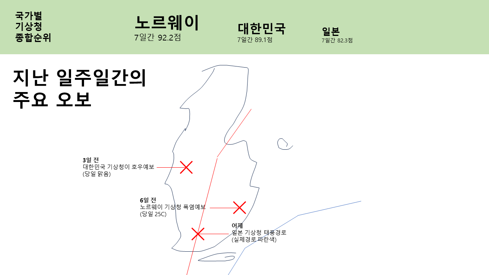

# For Koreans
[한국어 도움말](./docs/README-korean.md)이 있습니다!

# How much do you trust the weather service?

You've probably heard that the [Korea Meteorological Administration(KMA)](https://www.kma.go.kr/neng/index.do) is often wrong with its forecasts, so let's quantify whether they're really wrong or not.